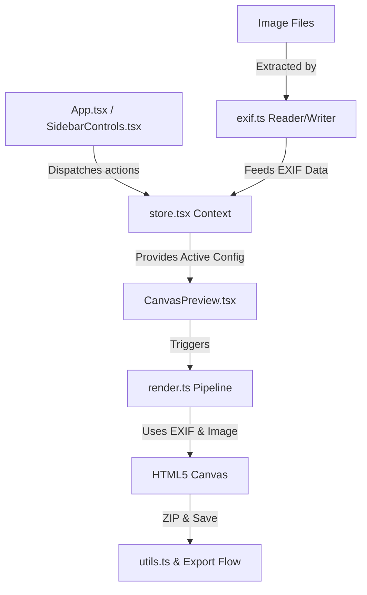

# Borderify Technical Plan & Architecture

This document describes the architectural layout and component responsibilities for the Borderify application, acting as the bridge between requirements in `specify.md` and the actual implementation files.

## 1. Component Overview

---

## 2. File Responsibilities

### State Management
*   **File:** [store.tsx](../src/store.tsx)
*   **Purpose:** Exposes `AppState` and configuration modifiers via a custom `useApp` hook.
*   **State Shape:** Manages uploaded images queue, active target image, and `AppConfig` presets (layout, fonts, pills, logos, export scales).

### Render Engine
*   **File:** [render.ts](../src/render.ts)
*   **Purpose:** Houses `renderPhotoBorder()`.
*   **Step Sequence:**
    1.  Determines final dimensions bound to longest edge scale limit.
    2.  Sets up background: fills flat color or draws low-res downsampled blur.
    3.  Draws card boundary with shadow and clipping path for rounded corners.
    4.  Draws target image inside the clipping path.
    5.  Measures and positions EXIF pills based on 9-point grid alignment calculations.
    6.  Parses and aligns custom text labels (supports dynamic template resolution).
    7.  Draws brand logos.

### EXIF Processor
*   **File:** [exif.ts](../src/exif.ts)
*   **Purpose:** Parses EXIF tags on load and inserts them during save.
*   **Libraries:** Uses `exifr` for client-side tag extraction, and `piexifjs` to re-inject raw EXIF segments into final export blobs.
