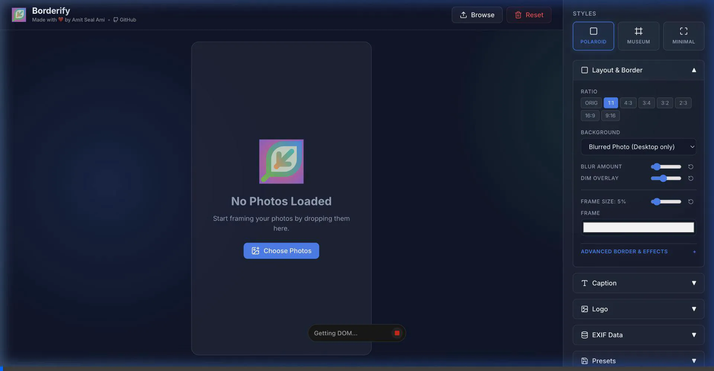

# Borderify

[Borderify](https://amitsealami.com/ai/borderify) is a open source Progressive Web App (PWA) for gallery-grade image styling, vibe coded from scratch using Google's Antigravity and Gemini 3.0 Pro/Flash. 

It allows you to add professional Polaroid-style borders, variable background blurring, and customize your image presentations effortlessly. It runs fully offline and can be installed natively on both mobile devices and desktops.

If you like this, do not forget to give us a Star! Your photos, their EXIF data, and anything that identifies you never leave your device; the hosted web app only has anonymous page-view analytics, so a star is the clearest signal that people use it.



## Running Locally

To get started with Borderify locally, you'll need Node.js installed.

```sh
git clone https://github.com/lordamit/borderify.git
cd borderify
npm install
npm run dev
```

This will start the Vite development server. You can access the app at `http://localhost:5173`.

Want to just try it in a browser without compiling from source? Check out the webapp hosted on GitHub: https://amitsealami.com/ai/borderify.

## Dev Docs

- **Build for production:** `npm run build`
- **Run tests (Vitest):** `npm run test` (watch) or `npm run coverage` (full suite with coverage)
- **Lint:** `npm run lint`

The core rendering logic is inside `src/render.ts`, and the state is managed in `src/store.tsx`. The application relies heavily on standard Web Canvas APIs for performance and accurate EXIF metadata preservation.

### Contributing: spec-driven workflow

This repository is spec-driven. Every behaviour has a requirement ID, and tooling checks the chain from specification to code to test to commit:

- **Specs** live next to the code as EARS requirements in `src/*.spec.md` (index: [`.specify/specify.md`](.specify/specify.md)). System-level rules carry `[ARC-NN]` IDs in [`.specify/memory/constitution.md`](.specify/memory/constitution.md); design rationale is in [`DESIGN_DECISIONS.md`](DESIGN_DECISIONS.md).
- **Tags** — the code that satisfies a requirement carries a `// [REQ-AREA-NN]` comment, and a test with the ID in its title must pass. `npm run verify-specs` checks all three links from executed test results (`-- --matrix` prints the table); `npm run lint-specs` checks EARS syntax.
- **Commits** that change `src/` must cite the affected IDs in the message, e.g. `fix(render): … [REQ-REND-06]`. A `fix` must also add a spec line (usually `If <condition>, then the system shall <response>`) and a test titled with that ID in the same branch or PR. `npm run check-commit-ids -- main..HEAD` runs the same check CI runs.
- **Hooks** — `npm install` sets `core.hooksPath` to `.specify/hooks`, so `pre-commit` runs the lint, traceability, and coverage checks and `commit-msg` runs the commit rules. Expect your first commit to be checked.
- **Changing behaviour** — edit the spec first, then the code and its tag, then the test. The full agent workflow is in [`.specify/prompts/implement.prompt.md`](.specify/prompts/implement.prompt.md).

## Features

The following features are implemented:

1. **Professional Styling:** Add Polaroid-style borders and variable background blurring.
2. **Preset Management:** Save and load your design configurations (borders, colors, margins, fonts, and logos) via JSON.
3. **Custom Export Settings:** Control JPEG compression quality and set resolution limits (Original, 4K, Facebook 2048px, Instagram 1350px).
4. **EXIF Preservation:** Original camera EXIF metadata is forcefully re-injected back into the final JPEG regardless of compression or scaling.
5. **Batch Processing:** Apply your selected preset and export settings to multiple photos at once.
6. **PWA Support:** Installable as a native-like app on iOS, Android, and Desktops.

We might implement additional features in the future based on user feedback. The current version is stable and should work as intended.

## Bugs

If you find any issues, please report them on [GitHub](https://github.com/LordAmit/borderify/issues)! The bug template asks which requirement IDs are affected (see [`.specify/specify.md`](.specify/specify.md)); write `unknown` if you cannot tell. Since this relies heavily on Canvas and File APIs, performance might vary on extremely old devices.

The blur effect does not work on mobile browsers, we are aware of that. I do not know why and how to fix it, so any help on this will be great. 

### iOS Safari Memory Limits

When processing extremely large RAW files or very high-resolution images in batch mode on older iOS devices, Safari might enforce strict memory limits. If the app reloads during export, try utilizing the `4K` or `Facebook` resolution limits.


## Disclaimer 

This project was initially vibe coded using **Google Antigravity** and **Gemini 3.0 Pro/Flash**.

This does not mean I did not know what I was doing, or at least what I wanted to achieve through vibe coding, since I have over a decade of combined experience from industry, academic background and software engineering research. 
However, I don't have experience in web tech as a stack nor do I have the time to develop my skills in it. 
Later, I learned more about AI-driven software engineering and restructured the repository to reflect some of the recent AI-driven software engineering practices, such as Spec Driven Development, Behavior Defined Testing and Agent Governance.

In the unlikely case that you find a bug in this app, I will probably attempt to solve it through AI-assisted coding. 

Regardless, use at your own risk. As far as the specification goes (`[ARC-02]` in the constitution), it does NOT:

  - send your photos, their EXIF data, or anything that identifies you to any server
  - corrupt local documents
  - corrupt your photos
  - harm you in any way

In other words, it is a free app as in free beer, literally. The only analytics is an anonymous page-view counter on the hosted web app, so I can estimate how many people use it.

## License

This project is licensed under the **Creative Commons Attribution 4.0 International (CC BY 4.0)** License. 

You are free to use and distribute this application, but any modifications, adaptations, or redistributions must provide clear attribution to the original creator (**Amit Seal Ami**). See the [LICENSE](LICENSE) file for the full legal text.
